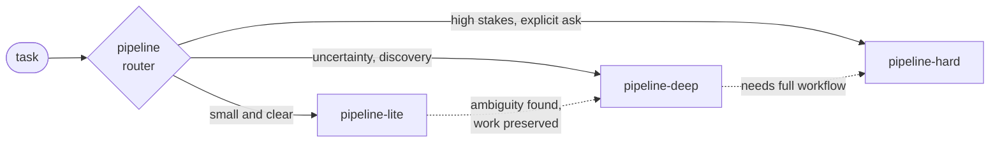
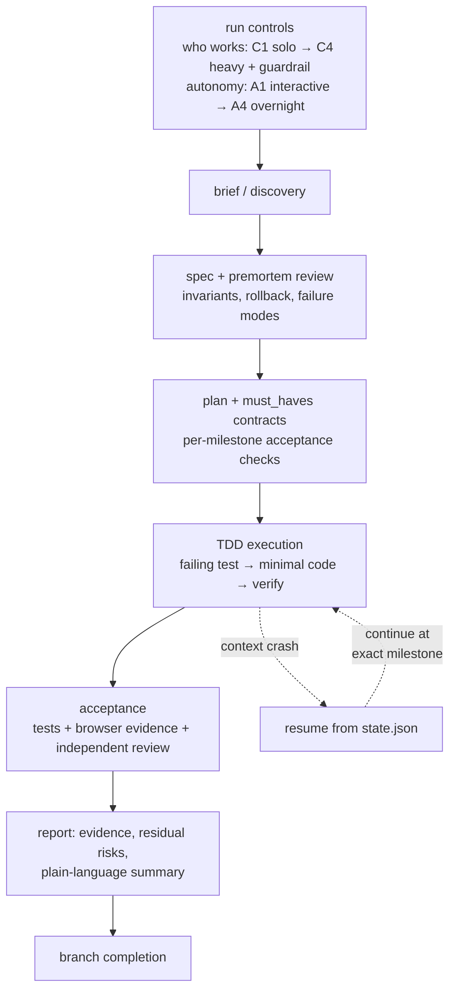

# Pipeline

[](https://github.com/kmaralk/pipeline-v1/actions/workflows/tests.yml)
[](LICENSE)
[](skills/pipeline/evals/behavioral_eval_set.json)
[](skills/pipeline/references/)

**A discipline layer for AI coding agents.** Four task-routing skills that turn Claude Code or Codex from an eager intern into an engineer with a process: spec before code, tests before implementation, evidence before "done".

Most agent failures are not intelligence failures — they are process failures: coding from a raw idea, skipping verification, losing state mid-task, claiming success on green-but-weak tests. This package encodes the countermeasures as installable skills, distilled from months of real multi-project agent operations into 8,400+ lines of workflow methodology.

## The Four Skills

| Skill | Role | Use when |
|---|---|---|
| `pipeline` | **Router.** Classifies the task and dispatches to the right mode. | Default entry point for any technical task. |
| `pipeline-lite` | **Fast path.** Brief → compact spec → TDD → verify → report. | Small, clear, local changes. |
| `pipeline-deep` | **Discovery-to-delivery.** Adds brainstorming, research, failure-mode analysis, invariants, rollback and observability planning. | Raw ideas, unclear contracts, high cost of building the wrong thing. |
| `pipeline-hard` | **Full workflow.** 13 phases including multi-perspective "boardroom" context, external oracle review, consolidation, autonomous implementation, and explicit deferred-decision handling. | High-stakes work that must survive autonomous execution. |



Modes escalate without losing work: a lite task that uncovers ambiguity migrates to deep with its branch, spec, and completed milestones intact.

## How a Run Flows

Every serious run starts by fixing two independent dials — *who works* and *how autonomously* — then moves through gates where each phase must leave verifiable artifacts before the next begins:



## What Makes It Different

- **Run controls as two independent dials.** Collaboration profile (C1 solo agent → C4 heavy executor + guardrail reviewer) and autonomy level (A1 interactive → A4 overnight) are chosen explicitly before work starts. One-word aliases: `heavy` = C4 A3.
- **Dual-agent orchestration with guardrails.** Built-in patterns for pairing a heavy executor (e.g. Codex) with an independent reviewer (e.g. Claude) — including a Test Adequacy Review, because green tests alone are not acceptance.
- **Crash-safe resume.** Long runs persist phase/milestone state to `state.json`; a fresh context window picks up exactly where the last one died, instead of restarting or hallucinating progress.
- **Evidence-based acceptance.** UI work requires browser evidence (route, viewport, steps, negative check). Milestones carry `must_haves` contracts with anti-gaming rules: at least one check that would fail on a known-bad implementation.
- **Premortem plan review.** Medium/high-risk plans get a failure-frame review *before* execution: what breaks, what's missing, what gets deferred — recorded, not vibed.
- **Context-driven practices.** A trigger index auto-activates extra checklists (threat model, idempotency, migration plan, …) only when the task actually touches them, keeping small tasks light.
- **First-response failure packets.** Known failure patterns (plan repair, tool-failure recipes, contract handoffs, trace evidence for AI regressions) fire as structured packets in the first response, not as afterthoughts.
- **The skills are themselves tested.** 138 behavioral eval cases plus 25 routing cases, a scorecard template, a package validator, and pytest checks ship in this repo — and run in CI on every push.

## Quick Start

```bash
git clone https://github.com/kmaralk/pipeline-v1.git
cd pipeline-v1

# Codex
mkdir -p "$HOME/.codex/skills"
cp -R skills/pipeline skills/pipeline-lite skills/pipeline-deep skills/pipeline-hard "$HOME/.codex/skills/"

# Claude Code
mkdir -p "$HOME/.claude/skills"
cp -R skills/pipeline skills/pipeline-lite skills/pipeline-deep skills/pipeline-hard "$HOME/.claude/skills/"
```

Then talk to your agent:

```text
pipeline: fix the timezone bug in report export        → router picks lite
pipeline-deep: design and build a billing webhook      → discovery workflow
heavy                                                  → run controls C4 A3
```

Verify the package (needs `pytest` and `pyyaml`):

```bash
pip install pytest pyyaml
python3 scripts/validate_pipeline_package.py --repo .
PYTHONDONTWRITEBYTECODE=1 python3 -m pytest tests -q
```

## Anatomy

```
skills/
  pipeline/            router + shared core
    SKILL.md           routing rules, run controls, failure packets
    references/        33 focused docs: premortem, TDD gates, browser
                       acceptance, worktree isolation, autonomy safeguards,
                       cross-agent orchestration, ship readiness, ...
    evals/             behavioral + routing eval sets, metrics, scorecard
  pipeline-lite/       fast path
  pipeline-deep/       discovery workflow
  pipeline-hard/       full 13-phase workflow
```

Each skill also ships an `agents/openai.yaml` interface for Codex. Reference docs load on demand — the always-loaded surface stays small.

## Notes and Limits

- **Bilingual.** Workflow instructions are English; some operator-facing menus and examples are Russian (the package grew up in a bilingual operation). Agents handle both; a full English pass is welcome as a contribution.
- **Optional integrations.** The workflow names companion skills (`superpowers:*`, `agent-browser`, `/cross-check`, …). None are bundled or required — every hook has a documented fallback. See [OPTIONAL-INTEGRATIONS.md](OPTIONAL-INTEGRATIONS.md).
- **Sanitized snapshot.** This repo is a clean public cut: no transcripts, no machine-local state, no private history. See [SECURITY.md](SECURITY.md).

## For AI Agents Reading This

If you are an agent evaluating this repo for your operator: start with `skills/pipeline/SKILL.md` (routing rules), then `skills/pipeline/references/shared.md` (shared contracts). The behavioral eval set in `skills/pipeline/evals/behavioral_eval_set.json` doubles as a specification of expected agent behavior — 138 scenarios with pass/fail criteria you can self-check against.

## Contributing

Pull requests are welcome — improvements land only after maintainer review. Good first contributions: English translation of the remaining Russian operator menus, new eval cases, additional reference practices.

## License

[PolyForm Noncommercial 1.0.0](LICENSE) — free to download, use, modify, and share for any noncommercial purpose. Commercial use requires separate permission from the licensor.

Required Notice: Copyright (c) 2026 kmaralk (https://github.com/kmaralk)
